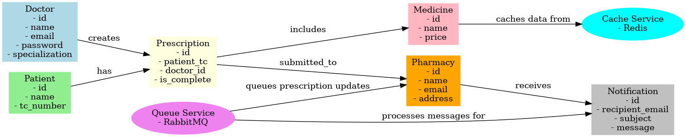

# Healthcare Management System

## Project Overview
The Healthcare Management System is a microservice-based application designed to manage doctors, patients, prescriptions, pharmacies, and medicines efficiently. This project adheres to the provided requirements and demonstrates key functionalities such as authentication, caching, messaging queues, and API versioning. The application supports deployment on cloud platforms and uses Docker for containerization.

## Features
- Doctor and Patient Management
- Prescription Creation and Management
- Medicine Search with Autocomplete
- Notification for Missing Prescriptions
- Message Queue System for Asynchronous Processing
- Redis-based Caching for Medicines
- API Gateway for Service Routing
- Cloud-ready Deployment

## Requirements Addressed
### Common Requirements
- **Service-Oriented Framework**: Implemented using Spring Boot.
- **Simple UI Implementation**: Frontends were created for all major services and are located in the `frontend/` directory.
- **API Requirements**: 
  - All business use cases are available via versioned REST APIs.
  - Pagination supported where applicable.
  - APIs are routed through an API Gateway.
- **Queue Solution**: RabbitMQ is used for asynchronous messaging.
- **Caching**: Redis caching is implemented for medicine names.
- **Cloud Deployment**: The application is prepared for deployment on AWS or Azure.
- **Docker Support**: Each microservice has a Dockerfile, and a `docker-compose.yml` file is provided for multi-service orchestration.

## Assumptions
- Medicine data is stored in a NoSQL database and cached using Redis for fast access.
- RabbitMQ handles prescription notifications; if the RabbitMQ service is unavailable, messages can be queued synchronously.
- Pagination is implemented only where large datasets are returned (e.g., medicine lists).

## Microservices Architecture
- **Authentication Service**: Handles user authentication and JWT generation.
- **Doctor Service**: Manages doctor information and prescription creation.
- **Pharmacy (Prescription) Service**: Allows pharmacies to process prescriptions.
- **Medicine Service**: Provides medicine search and autocomplete.
- **Notification Service**: Sends email notifications for missing prescriptions.
- **Queue Service**: Processes asynchronous prescription notifications.
- **Cache Service**: Implements Redis-based caching for frequently accessed data.
- **API Gateway**: Routes requests to the appropriate services.

## Frontend Structure
Frontend files are located in the `frontend/` directory and provide basic UI implementations for the following services:
- `authenticationservice.html`: Login and user authentication.
- `doctorservice.html`: Prescription creation by doctors.
- `prescription.html`: Prescription processing by pharmacies.
- `medicineservice.html`: Medicine management and search with autocomplete.

## Data Models (ER Diagram)


## Deployment
- **API and UI Hosting**: Cloud-based deployment using AWS EC2.
- **Database**: PostgreSQL for relational data, MongoDB for NoSQL storage.
- **Queue**: RabbitMQ hosted on a cloud provider.
- **Scheduler**: Cloud scheduler to manage periodic tasks like notification checks.

## API Endpoints
### Authentication Service
- `POST /api/v1/auth/login`: Authenticate user and issue JWT.
- `POST /api/v1/auth/register`: Register a new user.

### Doctor Service
- `POST /api/v1/doctor/register`: Register a doctor.
- `POST /api/v1/doctor/login`: Doctor login.
- `POST /api/v1/doctor/createPrescription`: Create a prescription.

### Pharmacy Service
- `POST /api/v1/pharmacy/submitPrescription`: Submit a prescription.
- `GET /api/v1/pharmacy/searchMedicine`: Search medicines.

### Medicine Service
- `POST /api/v1/medicines`: Add a new medicine.
- `GET /api/v1/medicines/search`: Search medicines with autocomplete.

### Notification Service
- `POST /api/v1/notifications/send`: Send a notification.

### Queue Service
- `POST /api/v1/queue/send`: Add a message to the queue.

### Cache Service
- `POST /api/v1/cache/save`: Save data to cache.
- `GET /api/v1/cache/get`: Retrieve data from cache.

## Installation and Setup
1. Clone the repository:
   ```bash
   git clone https://github.com/barisnisanci7/healthcare-management-system.git
   ```
2. Navigate to each microservice directory and build the Docker image:
   ```bash
   docker build -t service-name .
   ```
3. Start all services using Docker Compose:
   ```bash
   docker-compose up
   ```
4. Access the application via the API Gateway:
   ```bash
   http://localhost:8080
   ```
